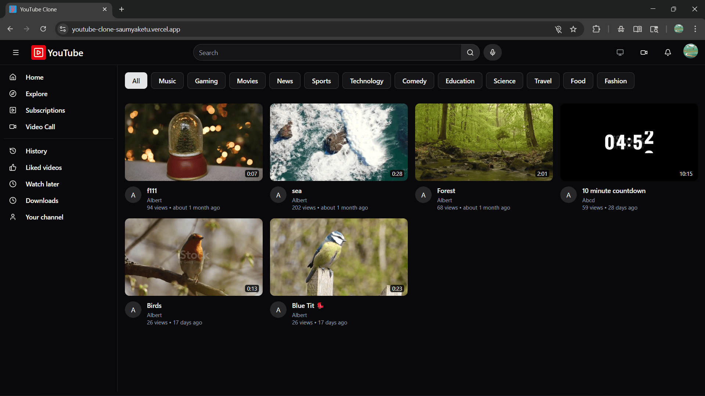
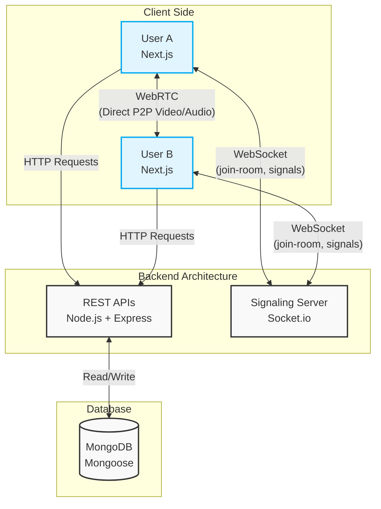

# YouTube Clone & Watch Party Platform

A full-stack video streaming and real-time communication platform built with Next.js, Node.js, and WebRTC.

* **YouTube-like platform** — video upload, streaming, likes, comments, and history  
* **Real-time watch parties** — synchronized playback using Socket.io  
* **Low-latency peer-to-peer video calling** — WebRTC-based rooms with screen sharing & recording  

Designed with a hybrid architecture (REST + WebSockets + WebRTC) for low-latency interaction.

## Demo
* **Live Site:** https://youtube-clone-saumyaketu.vercel.app



---

## Key Highlights
* **Video Streaming Platform** — Upload, watch, like, comment, and manage content.
* **Real-Time Watch Parties** — Sync video playback perfectly across multiple users.
* **WebRTC Video Calling** — Peer-to-peer video chat with mute, pin, and toggle features.
* **Screen Sharing + Recording** — Share your screen and record sessions locally.
* **Secure Authentication** — Google OAuth + Phone OTP via Firebase.
* **Payment Integration** — Razorpay for subscriptions & premium features.
* **PWA Support** — Fully installable app with offline capabilities.
* **Offline Downloads** — Save videos for later viewing.
* **Advanced Comment System** — Multilingual translation, city-based tagging, validation, and auto-moderation via dislikes.
* **Tiered Subscriptions** — Bronze, Silver, and Gold plans with watch-time limits, downloads, and Razorpay billing.
* **Context-Aware UI & Auth** — Dynamic theming and location-based OTP authentication logic.
* **Gesture-Controlled Player** — Tap-based controls for seek, pause, navigation, and UI interactions.

---

## System Design Overview



---

## Tech Stack

### Frontend
* **Framework:** Next.js (React 19)
* **Styling:** Tailwind CSS + Radix UI
* **Real-time:** `socket.io-client`, WebRTC (`simple-peer`)
* **State & Fetching:** Axios

### Backend
* **Environment:** Node.js + Express.js
* **Database:** MongoDB + Mongoose
* **Real-time Engine:** Socket.io

### Services & Tools
* **Auth:** Firebase Authentication
* **Storage:** Cloudinary, Multer
* **Payments:** Razorpay

---

## Features

### Video Platform
* Upload videos with custom thumbnails.
* Like, comment, and manage playlists.
* Automated watch history & "Watch Later" system.

### Watch Party (Real-Time Sync)
* Create rooms and invite users via unique links.
* Sync events: `play`, `pause`, and `seek`.
* Low-latency synchronization using WebSockets.

### Video Calling (WebRTC)
* Peer-to-peer connections with Socket.io signaling.
* Multi-user video chat rooms.
* Controls: mute/unmute, video toggle, and user pinning.

### Screen Sharing & Recording
* Screen sharing via browser APIs.
* Session recording using MediaRecorder API.

### Authentication & Payments
* **Auth:** Google OAuth, Phone OTP, and location-based logic.
* **Payments:** Razorpay integration for subscriptions.

### Advanced Playback & Gestures
* Custom video player with intuitive screen-tap zones:
    * Single-tap (center): Play/Pause.
    * Double-tap (left/right): Seek backward/forward by 10 seconds.
    * Triple-tap: Next video (center), close player (right), or open comments (left).
* Watch-time limits enforced based on subscription tier.

### Smart Commenting Engine
* Multilingual translation support using external APIs.
* City-level geotagging for user comments.
* Auto-moderation with dislike-based removal.
* Input validation to restrict unwanted characters.

### Context-Aware UI & Security
* Dynamic theming based on time and user location.
* Location-based authentication (Email OTP vs Mobile OTP).

### Premium Monetization
* Free tier limited to 1 video download per day.
* Tiered plans: Bronze, Silver, Gold.
* Unlimited downloads and extended watch-time for premium users.
* Automated invoice emails on successful payment.
---

## API Architecture

### 1. REST APIs
* **User:** Authentication, profile updates, and download eligibility.
* **Video:** Uploading via Multer/Cloudinary and metadata retrieval.
* **Engagement:** Managing likes, comments, playlists, and watch history.

### 2. WebSockets (Socket.io)
* **Room Management:** `join-room` logic.
* **WebRTC Signaling:** `sending-signal`, `returning-signal`.
* **Playback Sync:** `video-play`, `video-pause`, `video-seek`.

---

## Getting Started

### Prerequisites
* Node.js (v18+)
* MongoDB instance
* Accounts for Firebase, Cloudinary, and Razorpay

### Installation & Setup

1. **Clone the repository:**
   ```bash
   git clone https://github.com/Saumyaketu/Youtube-clone.git
   cd Youtube-clone
   ```

2. **Environment Variables:**
   Copy the sample environment files and fill in your credentials.
   ```bash
   # In the server directory:
   cp .env.sample .env
   
   # In the frontend directory:
   cp .env.sample .env.local
   ```

3. **Start the Backend:**
   ```bash
   cd server
   npm install
   npm start
   ```

4. **Start the Frontend:**
   ```bash
   cd frontend
   npm install
   npm run dev
   ```

---

## Challenges Solved
* Ensuring zero-latency state synchronization across multiple users during watch parties.
* Managing complex WebRTC signaling and peer connection drops gracefully.
* Handling large media file uploads and streaming efficiently without bottlenecking the server.

---

## Security & Best Practices
* Strict input validation and sanitization for user comments to prevent injection.
* Secure, webhook-verified payment processing via Razorpay.
* Secure authentication flows utilizing Firebase and Nodemailer for OTP verification.

---

## Future Improvements
* **Scalable WebRTC:** Implement an SFU (Selective Forwarding Unit) to support massive rooms without client-side CPU strain.
* **Recommendation System:** Integrate ML-based video suggestions based on watch history.
* **Video Transcoding:** Add a pipeline to generate multiple resolutions (e.g., 360p, 720p, 1080p) for adaptive bitrate streaming.
* **Caching Layer:** Integrate Redis to speed up frequent database queries.

---
*Built by Saumyaketu Chand Gupta*